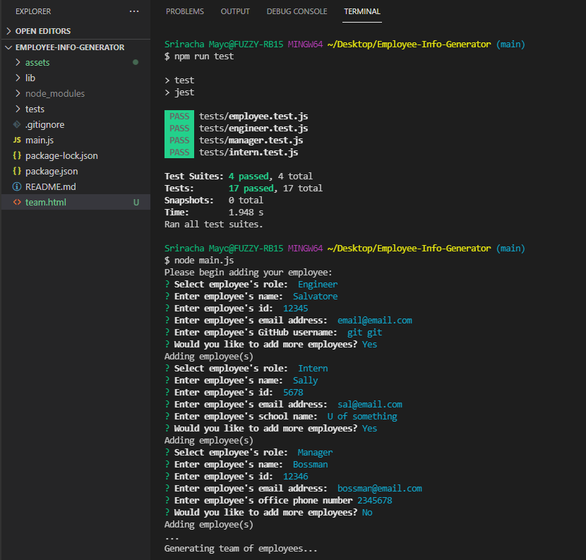
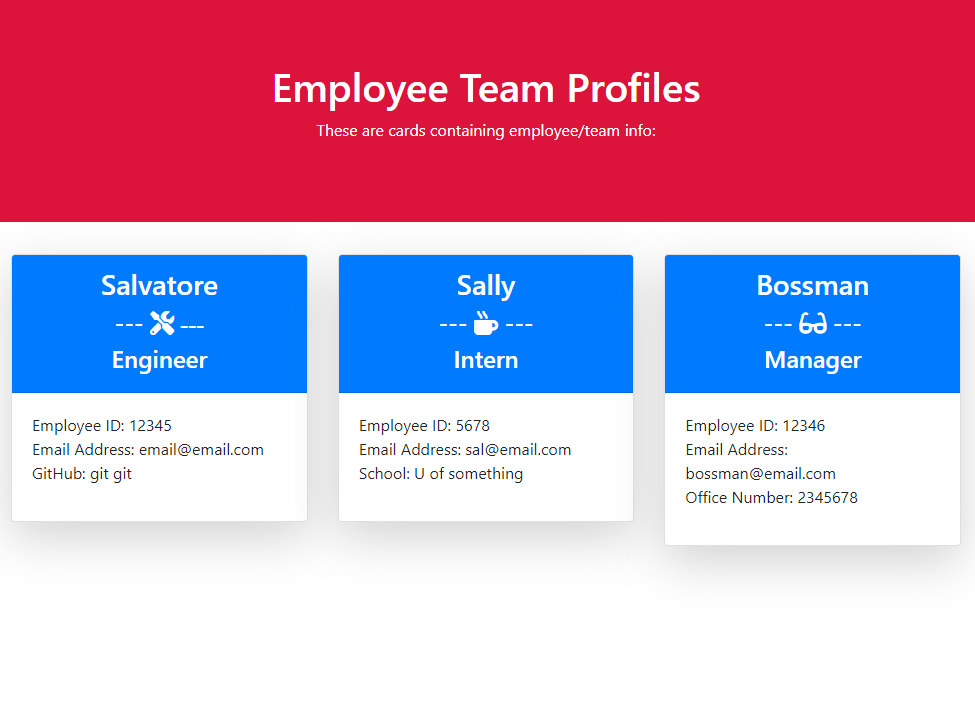

# Employee-Info-Generator
## About the employee generator:

The purpose of this educational assignment was to create a command line application that takes employee info, and generates a html page that displays 
summaries of the employees, creating a team list. Testing is also added to the code to render it maintanable. 

1. Present user with command line 
2. User runs 'npm run test' to run tests, then 'node main.js' to run the file
3. User is presented with employee selections and questions to fill
4. User is presented the next question after 'enter'
5. User is presented with a html card of employee info dynamically created
6. When the user if finished, they are prompted if they want to add additional employees
7. Selecting 'Yes' runs the user through the selections again
8. Selecting 'No' ends the application
9. User is presented back to original command line directory

## Built With:

* Node
* Javascript
* jQuery
* HTML
* CSS
* Bootstrap

## Use:

User can create a team/employee info card list.

Install:
* npm init
* npm install inquirer
* npm install --save-dev jest

Run:
* npm run test
* node main.js

*Used to learn, practice, test, understand, and implement various JavaScript tools including test driven development: 

* file system reading/writing dynamically 
* Node.js built in function 'require' to load modules
* create CLI with promise-based npm 'inquirer' package
* create tests
* create and use 'module.export' : https://www.sitepoint.com/understanding-module-exports-exports-node-js/

## Contact:

* https://github.com/kitclong/Employee-Info-Generator
* https://youtu.be/dGfcIt-2100

## Acknowledgments:

* npm
* MDN Web Docs
* getbootstrap
* w3schools
* Stackoverflow
* Freecodecamp
* Trilogy Education services
* local tutoring services
* Additional private tutoring 
